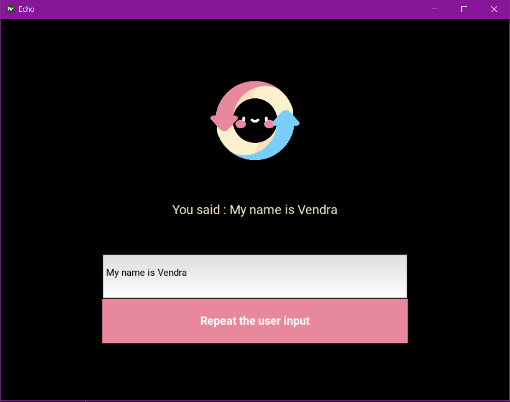

# Simple Python App With Kivy

A GUI made with the help of kivy framework.

## Objective:

To understand the working and process of the kivy framework and applying it in Python GUI.

### Install Kivy with the help of -
`pip install Kivy`

